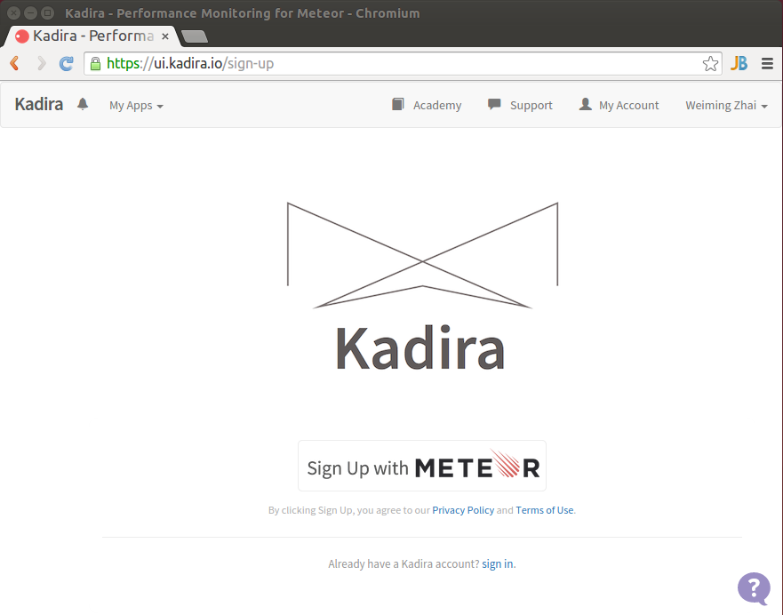
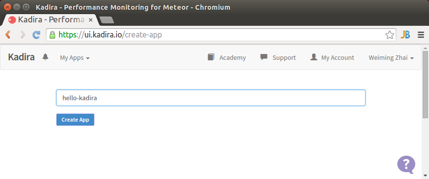
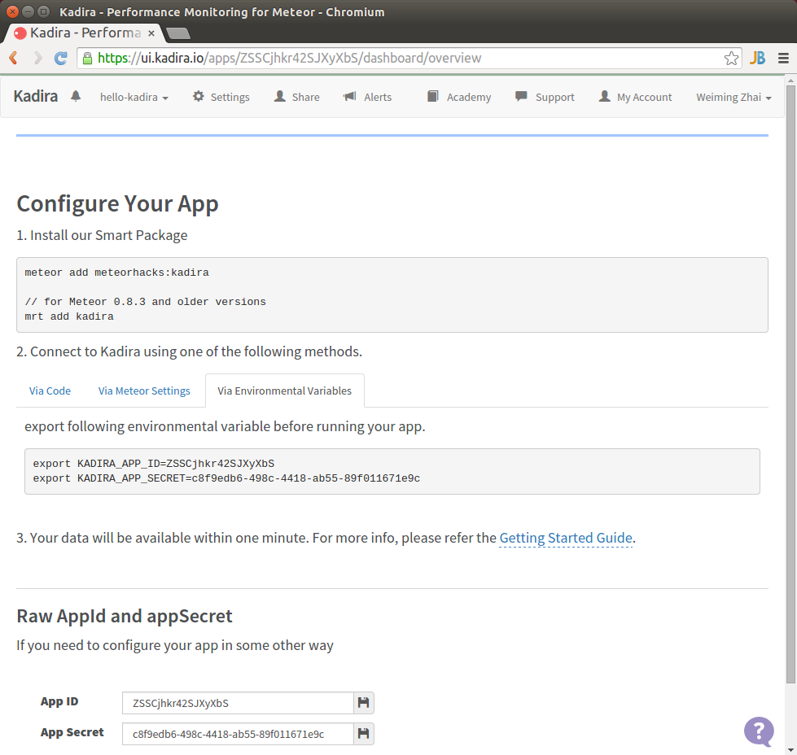

# Kadira入门

Kadira是一个非常好用的Meteor性能监测工具，本节给出基本的使用指南。

## 1. 登录Kadira创建App

首先登录到Kadira主页 [https://kadira.io/](https://kadira.io/),登录过程中土建使用Meteor账号登录。然后显示如下登录界面

然后点击左上角的`My Apps`，再选择`+Create New`创建项目，输入项目名称为`hello-kadira`,然后点击`Create App`

最终可以见到如下界面，注意在这个界面里面，Kadira为我们自动生成了KADIRA_APP_ID和KADIRA_APP_SECRET2个变量，后期程序的数据就是通过这些唯一ID上传到Kadira服务器的

	KADIRA_APP_ID=ZSSCjhkr42SJXyXbS 
	KADIRA_APP_SECRET=c8f9edb6-498c-4418-ab55-89f011671e9c

## 2. 新建项目

$ meteor create hello-kadira

